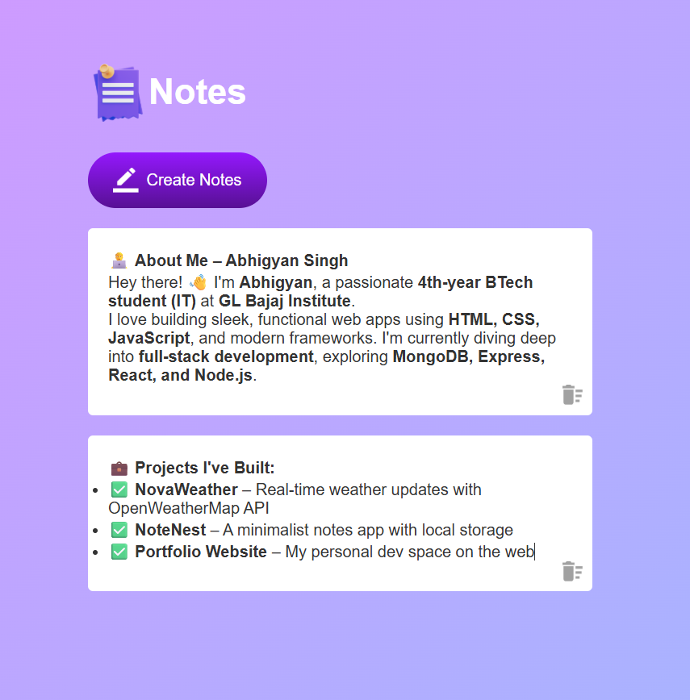

---

# 📝 NoteNest – Your Personal Note Companion 🚀

Welcome to **NoteNest** — a modern, minimalist, and lightning-fast notes app built using **HTML**, **CSS**, and **JavaScript**. Whether it's your next big idea 💡, grocery list 🛒, or daily goals 🎯 — keep everything at your fingertips!

---

## ✨ Features

🗂️ **Add, Edit, Delete Notes** — Simple & intuitive
💾 **Persistent Storage** — Powered by `localStorage` to save your notes forever
🎨 **Responsive Design** — Looks great on desktop 💻, tablet 📱, and mobile
🖊️ **Live Editing** — No save button, just type and go
🧼 **Minimal UI** — Distraction-free and user-friendly
🌈 **Custom Styling** — Beautiful color palette and animations

---

## 🔧 Tech Stack

* **HTML** 💻
* **CSS** 🎨
* **JavaScript (Vanilla)** ⚡
* **LocalStorage API** 🧠

---

## 📸 Sneak Peek



---

## 🚀 Getting Started

1. **Clone the repo**

   ```bash
   git clone https://github.com/Abhigyansingh47/NoteNest-App.git
   cd NoteNest-App
   ```

2. **Open `index.html` in your browser**
   That’s it! No build tools, no setup headaches. Just write and save!

---

## 💡 Inspiration

Built as part of a learning journey to master DOM manipulation, data persistence, and responsive layouts — NoteNest is ideal for beginners and a cool addition to your portfolio. 🌟

---
## 📚 License

This project is open-source under the [MIT License](LICENSE).

---
